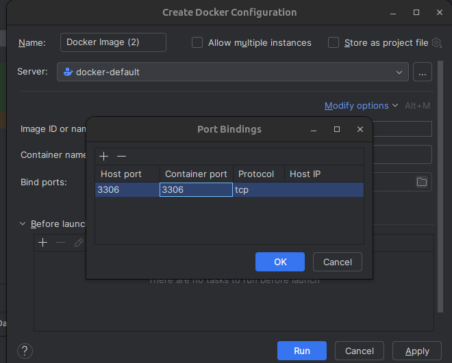

# Setup MySql Database inside IntelliJ

## General
- database name = mydatabase
- user = root
- password = root

## How to Create Docker Container
Make sure to have Docker enabled in IntelliJ.

From the Services window (bottom right):
- click "images"
- download image ```eduardvalentindumitrescul/mysql-pixelplay:latest```
- create container from this image
- Modify Options -> Bind Ports -> Press +


## How to Access Mysql
- from container -> terminal
- write ```mysql -p``` (password is ```root```)
- you are inside mysql